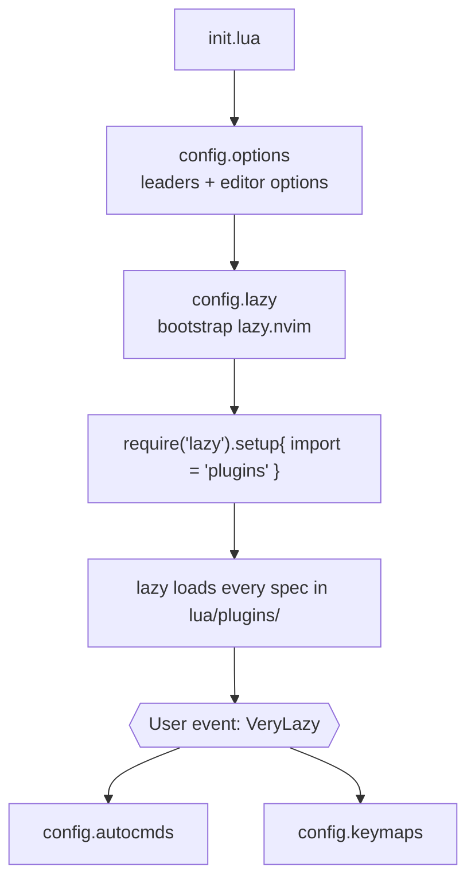
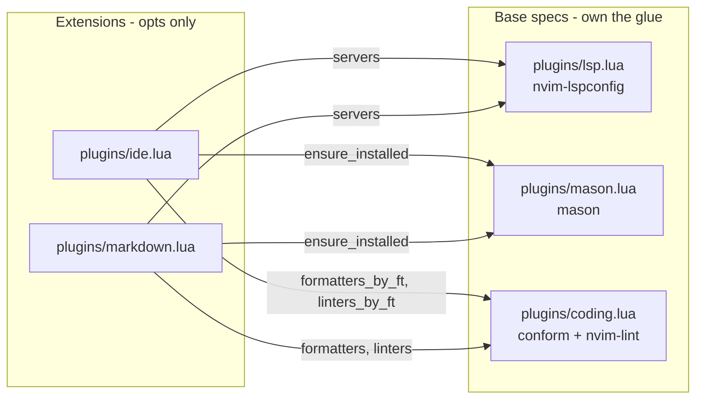
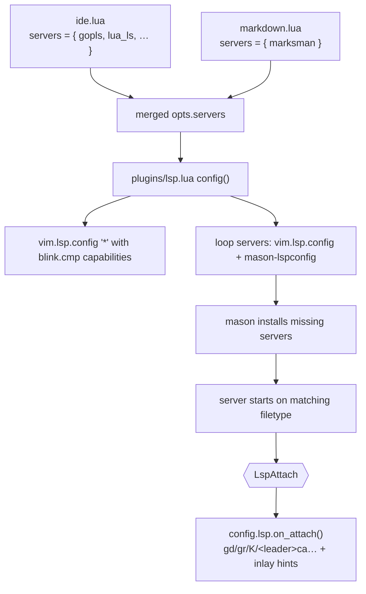

# Dotfiles

<!--toc:start-->
- [Dotfiles](#dotfiles)
  - [Installation](#installation)
    - [Prerequisites](#prerequisites)
    - [Setup](#setup)
  - [Usage](#usage)
    - [Neovim Integrations](#neovim-integrations)
      - [Architecture](#architecture)
      - [Go Development (`go.nvim`)](#go-development-gonvim)
      - [Go mod utilities](#go-mod-utilities)
      - [Go Testing (`neotest` + `neotest-golang`)](#go-testing-neotest--neotest-golang)
      - [Go Debugging (`nvim-dap` + `nvim-dap-go`)](#go-debugging-nvim-dap--nvim-dap-go)
      - [Go Linting (`nvim-lint` + `golangci-lint`)](#go-linting-nvim-lint--golangci-lint)
      - [LSP (Language Servers)](#lsp-language-servers)
      - [GitHub — Octo (`octo.nvim`)](#github--octo-octonvim)
      - [GitHub Releases (`nvim-ghrelease`)](#github-releases-nvim-ghrelease)
      - [PlantUML (`plantuml-previewer.vim`)](#plantuml-plantuml-previewervim)
      - [Case Coercion (`vim-abolish`)](#case-coercion-vim-abolish)
      - [Text Alignment (`mini.align`)](#text-alignment-minialign)
      - [Symbol Navigation (`aerial.nvim`)](#symbol-navigation-aerialnvim)
      - [Color Highlighting (`nvim-colorizer`)](#color-highlighting-nvim-colorizer)
      - [Image Rendering (`image.nvim`)](#image-rendering-imagenvim)
      - [Snippets (`LuaSnip`)](#snippets-luasnip)
      - [Colorscheme (`catppuccin`)](#colorscheme-catppuccin)
      - [Dashboard (`snacks.nvim`)](#dashboard-snacksnvim)
      - [UI Select/Input (`dressing.nvim`)](#ui-selectinput-dressingnvim)
      - [Bundled Editing Features](#bundled-editing-features)
      - [Claude Code (`claudecode.nvim`)](#claude-code-claudecodenvim)
      - [Treesitter Text-Object Navigation](#treesitter-text-object-navigation)
      - [Auto-save](#auto-save)
      - [Global Shortcuts](#global-shortcuts)
    - [Taskwarrior](#taskwarrior)
      - [Core concepts](#core-concepts)
      - [Common commands](#common-commands)
      - [Configured urgency weights](#configured-urgency-weights)
      - [Date format](#date-format)
      - [TUI (`taskwarrior-tui`)](#tui-taskwarrior-tui)
      - [Color scheme (Nord-inspired)](#color-scheme-nord-inspired)
<!--toc:end-->

This project streamlines the installation of software and configurations I use
daily. It is tailored to my personal workflow and preferences. Pull requests are
welcome, provided they do not conflict with my personal setup.

## Installation

### Prerequisites

- Git must be installed. On Debian/Ubuntu:

  ```bash
  sudo apt install git -y
  ```

### Setup

1. Clone the repository:

   ```bash
   git clone git@github.com:mesirendon/dotfiles.git ~/.dotfiles
   ```

2. Enter the directory:

   ```bash
   cd ~/.dotfiles
   ```

3. Run the bootstrap script (you may be prompted for your password):

   ```bash
   ./bootstrap.sh
   ```

4. Restart your system:

   ```bash
   sudo reboot
   ```

## Usage

### Neovim Integrations

The Neovim config is a **standalone** setup built directly on
[lazy.nvim](https://github.com/folke/lazy.nvim) — no distribution. All config
lives under `nvim/.config/nvim/lua/`. See
[nvim/.config/nvim/README.md](nvim/.config/nvim/README.md) for the deep dive.

#### Architecture

| Concern | Choice |
| --- | --- |
| Plugin manager | lazy.nvim |
| Completion | `blink.cmp` + `LuaSnip` |
| Picker / UI | Snacks (picker, explorer, dashboard), which-key, lualine, bufferline, noice |
| LSP | native `vim.lsp.config` / `vim.lsp.enable` + Mason |
| Treesitter | `arborist` (nvim-treesitter disabled) |
| Theme | `catppuccin-mocha` |

**Load order.** `init.lua` loads options (which set `<leader>`) *before*
lazy.nvim, then keymaps/autocmds load on `VeryLazy` once the UI is ready:



**Base specs + extensions, merged by name.** lazy.nvim deep-merges every spec
that shares the same plugin repo name, across all files. Heavy `config`/glue
lives in **base specs**; small **extension files** only add `opts` that merge
upward. This is how you plug new things in without touching the plumbing:



**LSP pipeline.** Servers are declared as data (`opts.servers`); `plugins/lsp.lua`
turns that into running servers, and keymaps attach per-buffer via
`config/lsp.lua`, gated by what each server supports:



**Adding new plugins & integrations:**

- **New standalone plugin** — drop a file in `lua/plugins/` returning a lazy
  spec (`{ "author/foo.nvim", opts = {} }`); the whole folder is imported.
- **New LSP server** — add it to `opts.servers` on `nvim-lspconfig` (in `ide.lua`
  or a language file); Mason auto-installs it and attach keymaps come for free.
- **New formatter/linter** — extend `conform.nvim`'s `formatters_by_ft` /
  `nvim-lint`'s `linters_by_ft`, and add the tool to any `mason.nvim`
  `ensure_installed` (lists are concatenated via `opts_extend`, never replaced).
- **New keymaps** — a spec's `keys` field (lazy-loading), `lua/config/keymaps.lua`
  (global), or a `FileType` autocmd (buffer-local; see the Go block).
- **Extend an existing plugin** — declare a spec with the *same repo name* and
  your `opts`; lazy merges it into the base.
- **Shared helpers** — `require("util").root()`, `require("config.icons").icons`,
  `require("util").on_load(name, fn)` replace the old `LazyVim.*` global.

#### Go Development (`go.nvim`)

Struct, error, interface, and tag utilities. All mappings are `<localleader>g*` inside `.go` files.

| Keymap | Description | Example |
| --- | --- | --- |
| `<localleader>gf` | Fill struct fields with zero values | Cursor on `MyStruct{}` → fills all fields |
| `<localleader>ge` | Wrap with `if err != nil { return ..., err }` | Cursor after an `err`-returning call |
| `<localleader>gi` | Stub all methods for an interface | Cursor on a type, enter interface name in prompt |
| `<localleader>ga` | Add `json:"..."` tags to struct fields | Cursor anywhere in struct |
| `<localleader>gA` | Remove struct tags | Cursor anywhere in struct |
| `<localleader>gT` | Modify struct tags | Interactive prompt for tag options |
| `<localleader>go` | Toggle between `foo.go` and `foo_test.go` | Fast source/test switching |
| `<localleader>gc` | Generate doc comment for the function | Cursor on `func` line |

#### Go mod utilities

Inside `go.mod` files, `<localleader>g*` drives module commands.

| Keymap | Description |
| --- | --- |
| `<localleader>gg` | `go get -u ./...` — update all dependencies |
| `<localleader>gt` | `go mod tidy` |
| `<localleader>gu` | Bump Go version + toolchain to latest (fetches from go.dev) |

#### Go Testing (`neotest` + `neotest-golang`)

`<localleader>t*` inside `.go` files. Tests run with `-v -coverprofile=coverage.out` and `-race` when CGO is available.

| Keymap | Description |
| --- | --- |
| `<localleader>tn` | Run nearest test |
| `<localleader>tv` | Run nearest test (verbose) |
| `<localleader>tf` | Run all tests in current file |
| `<localleader>tp` | Run all tests in current package/directory |
| `<localleader>ta` | Run all tests in the suite |
| `<localleader>tA` | Run all tests with optional `-tags` prompt |
| `<localleader>tu` | Run package tests with `-update` (update snapshots) |
| `<localleader>tl` | Re-run last test |
| `<localleader>to` | Show last test output |
| `<localleader>ts` | Toggle test summary panel |
| `<localleader>td` | Debug nearest test (launches Delve) |
| `<localleader>tC` | Print coverage summary from `coverage.out` |
| `<localleader>tH` | Open HTML coverage report in browser |

#### Go Debugging (`nvim-dap` + `nvim-dap-go`)

`<localleader>d*` inside `.go` files. Delve is the adapter.

| Keymap | Description |
| --- | --- |
| `<localleader>db` | Toggle breakpoint |
| `<localleader>dB` | Set conditional breakpoint |
| `<localleader>dC` | Clear all breakpoints |
| `<localleader>dc` | Start / continue |
| `<localleader>di` | Step into |
| `<localleader>do` | Step over |
| `<localleader>dO` | Step out |
| `<localleader>dr` | Restart session |
| `<localleader>dS` | Stop session |
| `<localleader>du` | Toggle DAP UI (scopes / stacks / breakpoints / REPL) |
| `<localleader>ds` | Open scopes/stacks/breakpoints view |
| `<localleader>dv` | Inspect variable under cursor |

Two launch configs are available when starting (`<localleader>dc`): **Debug Main** (workspace `main`) and **Debug Current File**. `AWS_PROFILE` and `AWS_REGION` are forwarded automatically.

#### Go Linting (`nvim-lint` + `golangci-lint`)

Linting is intentionally **not** configured globally — `golangci-lint` runs against whatever `.golangci.yml`/`.golangci.toml` (or lack thereof) exists in the current project. This dotfiles repo only installs the binary and wires up the keymaps; rule selection is left entirely to each project.

| Keymap | Description |
| --- | --- |
| `<localleader>ll` | Run `golangci-lint` on current package and display results |
| `<localleader>lr` | Clear lint diagnostics |
| `<localleader>ld` | Show diagnostic detail for symbol under cursor |
| `<localleader>lD` | Open full diagnostics list |

#### LSP (Language Servers)

Managed by Mason + nvim-lspconfig. Active servers:

| Language | Server | Extras |
| --- | --- | --- |
| Go | `gopls` | standard config (`gofumpt` formatting, `fieldalignment` analysis, full inlay-hint set: assign types, composite literal fields, constant values, function type params, ignored errors, parameter names, range var types) — no extra analyzers or `staticcheck` overrides |
| TypeScript/JS | `vtsls` | — |
| Lua | `lua-language-server` | vim global pre-loaded |
| Bash/Shell | `bash-language-server` | — |
| YAML | `yaml-language-server` | GitHub Actions + docker-compose schemas |
| Docker | `dockerls` | — |

Formatters run on save via `conform.nvim` (`gofumpt`+`goimports` for Go, `prettierd` for web, `stylua` for Lua, `shfmt` for shell). Linters run via `nvim-lint` (`golangci-lint`, `eslint_d`, `shellcheck`).

#### GitHub — Octo (`octo.nvim`)

PR and issue management without leaving Neovim. Uses `fzf-lua` as the picker.

**Top-level mappings** (`<leader>o*`):

| Keymap | Description |
| --- | --- |
| `<leader>opp` | List PRs |
| `<leader>opn` | Create new PR |
| `<leader>opv` | View current PR |
| `<leader>opc` | Checkout PR |
| `<leader>opk` | PR checks / CI status |
| `<leader>opm` | Merge PR (squash by default) |
| `<leader>opl` | Reload PR |
| `<leader>opr` | Start review |
| `<leader>ops` | Submit review |
| `<leader>opb` | Open PR in browser |
| `<leader>oa` | Assign PR/issue to me |
| `<leader>or` | Add reviewer |
| `<leader>oil` | List issues |
| `<leader>oic` | Create issue |
| `<leader>oiv` | View issue |

Inside an Octo buffer, `<localleader>p*` drives PR actions (checkout, merge variants, commits, files, diff), `<localleader>i*` drives issue actions (close, reopen, list), `<localleader>l*` manages labels (add, remove, create), and `<localleader>a*` manages assignees (add, remove). `<localleader>ca/cr/cd` add, reply, or delete comments; `[c/]c` jump between comments.

#### GitHub Releases (`nvim-ghrelease`)

A `gh` CLI wrapper of my own
([mesirendon/nvim-ghrelease](https://github.com/mesirendon/nvim-ghrelease)) for
cutting GitHub releases without leaving the editor. Configured in
`plugins/ghrelease.lua`; loads lazily on the `:GhRelease` command.

| Keymap / Command | Description |
| --- | --- |
| `<leader>gr` | Create a GitHub release |
| `:GhRelease` | Same, as a command |

The plugin's own default keymap is disabled (`keymaps.create = false`) so the
binding is declared here instead.

#### PlantUML (`plantuml-previewer.vim`)

Live-reloading diagram preview for `.puml` files. The PlantUML jar is located automatically via Homebrew.

| Keymap | Description |
| --- | --- |
| `<localleader>up` | Open live preview in browser |
| `<localleader>ur` | Force reload (re-saves the buffer) |
| `<localleader>us` | Export to SVG or PNG (prompts for format) |

Edits trigger a debounced (600 ms) re-render automatically — no manual reload needed while typing.

#### Case Coercion (`vim-abolish`)

Change identifier case with `cr*` in normal mode (cursor on any word):

| Keymap | Result |
| --- | --- |
| `crs` | `snake_case` |
| `crc` | `camelCase` |
| `crm` | `PascalCase` |
| `cru` | `UPPER_SNAKE_CASE` |
| `cr-` | `kebab-case` |
| `crt` | `Title Case` |

#### Text Alignment (`mini.align`)

| Keymap | Mode | Description |
| --- | --- | --- |
| `ga` | normal/visual | Align selection around a character (enter delimiter at prompt) |
| `gA` | normal/visual | Align with live preview |

Example: select a block of variable assignments and press `ga=` to align all `=` signs.

#### Symbol Navigation (`aerial.nvim`)

Opened via `<leader>cs` (or `:AerialToggle`). Shows a sidebar outline of functions, types, and methods with min width 50 / max width 80.

#### Color Highlighting (`nvim-colorizer`)

Automatically active in `css`, `scss`, `sass`, `html`, `javascript`, `typescript`, and `lua` files. Renders `#RGB`, `#RRGGBB`, `rgb()`, `hsl()`, and Tailwind color names as inline color swatches.

#### Image Rendering (`image.nvim`)

Renders images inline using the Kitty terminal protocol. Supported formats: `png`, `jpg`, `jpeg`, `gif`, `webp`, `svg`. Markdown image tags render automatically; images clear in insert mode. Max display size is 100 × 40 cells.

#### Snippets (`LuaSnip`)

Custom snippets live in `nvim/.config/nvim/lua/snippets/`. Go template snippets are in `snippets/gotmpl.lua`. LuaSnip is the snippet engine behind `blink.cmp`, and community snippets (`friendly-snippets`) are loaded too — all surfaced through the blink completion menu.

#### Colorscheme (`catppuccin`)

`catppuccin-mocha` flavour, set as the default colorscheme in `plugins/colorscheme.lua`.

#### Dashboard (`snacks.nvim`)

Custom start screen: custom ASCII header, footer ("Write. Build. Learn."), and an optional `chafa`-rendered logo section (shown only if `~/.config/nvim/logo.png` exists).

#### UI Select/Input (`dressing.nvim`)

Improves the look of `vim.ui.select`/`vim.ui.input` prompts (used by things like `GoImpl`'s interface-name prompt and LSP code actions).

#### Bundled Editing Features

Beyond the language servers above, these are wired as explicit specs under
`plugins/`: `mini.surround` + `mini.comment` (`coding.lua`), `mini.pairs` +
`mini.ai` (`coding.lua`), `gitui` (`gitui.lua`, `<leader>gg`/`<leader>gG`),
`kulala.nvim` REST client (`rest.lua`, `<leader>R*`), `aerial` (`aerial.lua`),
`render-markdown` + `markdown-preview` (`markdown.lua`), and `claudecode.nvim`
(`claudecode.lua`).

#### Claude Code (`claudecode.nvim`)

Bridges the Claude Code CLI with Neovim — file context, selection sharing, and diff review. Configured in `plugins/claudecode.lua`. Activate the CLI with `claude` in a terminal; the plugin syncs the active buffer automatically.

#### Treesitter Text-Object Navigation

Jump between code constructs with `]`/`[` in normal mode:

| Keymap | Description |
| --- | --- |
| `]f` / `[f` | Next / prev function start |
| `]F` / `[F` | Next / prev function end |
| `]c` / `[c` | Next / prev class start |
| `]C` / `[C` | Next / prev class end |
| `]a` / `[a` | Next / prev parameter start |
| `]A` / `[A` | Next / prev parameter end |

`<Alt-Space>` expands the treesitter selection node by node; `<Backspace>` contracts it.

#### Auto-save

Buffers are saved automatically on `BufLeave`, `WinLeave`, and `FocusLost`. Only normal file buffers are written — terminals, readonly files, and scratch buffers are skipped silently.

#### Global Shortcuts

| Keymap | Description |
| --- | --- |
| `+` | Increment number under cursor (`<C-a>`) |
| `-` | Decrement number under cursor (`<C-x>`) |

---

### Taskwarrior

CLI task manager with a TUI frontend (`taskwarrior-tui`). Config is stowed from `taskwarrior/`.

#### Core concepts

- **Projects** group related tasks (`project:work`).
- **Tags** label tasks for filtering (`+next`, `+waiting`).
- **Urgency** is a computed score that drives the default `next` report sort order.

#### Common commands

| Command | Description |
| --- | --- |
| `task add <description> project:<name> +<tag> due:<date>` | Add a task |
| `task next` | Default view — all pending tasks sorted by urgency |
| `task <id> done` | Mark task complete |
| `task <id> delete` | Delete task |
| `task <id> modify due:<date>` | Change a field on an existing task |
| `task <id> start` | Start working on a task (sets `start` timestamp) |
| `task <id> stop` | Stop without completing |
| `task <id> annotate <note>` | Attach a timestamped note |
| `task project:<name>` | Filter by project |
| `task +<tag>` | Filter by tag |
| `task calendar` | Month view with due dates |

#### Configured urgency weights

| Tag / Project | Coefficient | Effect |
| --- | --- | --- |
| `+next` | +15 | Floats to top of queue |
| `+waiting` | −3 | Pushes to bottom |
| Any user project | +1 | Slight boost over unprojectd tasks |

#### Date format

Dates are entered and displayed as `m/d/Y` (e.g. `6/30/2026`). Annotations include time: `m/d/Y H:N:S`.

#### TUI (`taskwarrior-tui`)

Launch with `tw`. Vim-style keybindings:

| Key | Action |
| --- | --- |
| `j` / `k` | Move down / up |
| `h` / `l` | Move left / right |
| `Space` | Toggle task done |
| `a` | Add task |
| `e` | Edit task (opens `$EDITOR`) |
| `m` | Modify task |
| `d` / `x` | Delete task |
| `/` | Filter |
| `r` | Refresh |
| `q` / `ZZ` | Quit |

#### Color scheme (Nord-inspired)

| State | Appearance |
| --- | --- |
| `+next` tag | Bold white on blue |
| `+waiting` tag | Black on yellow |
| Due soon | Bold white on cyan |
| Overdue | White on red |
| Completed | Bold black on green |
| Active (started) | Bold white on magenta |
